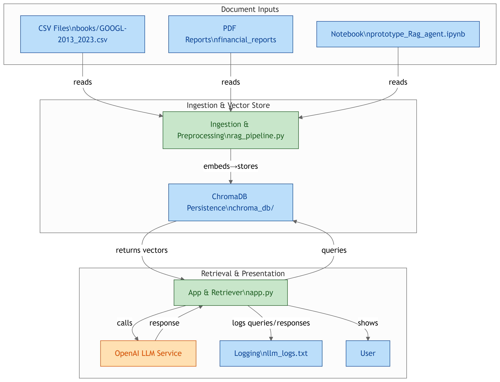
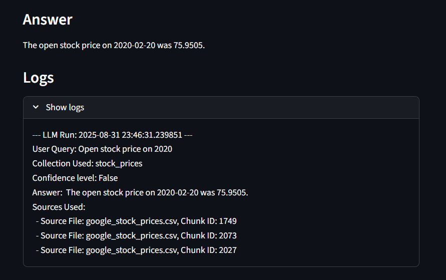
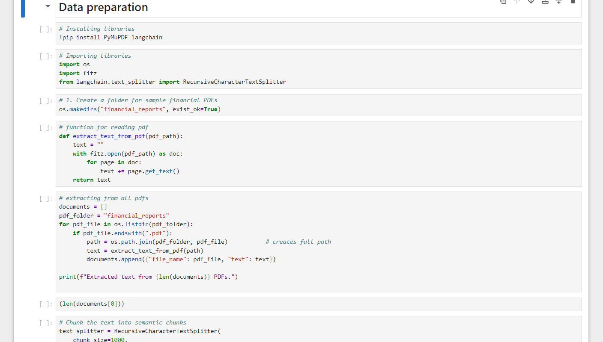
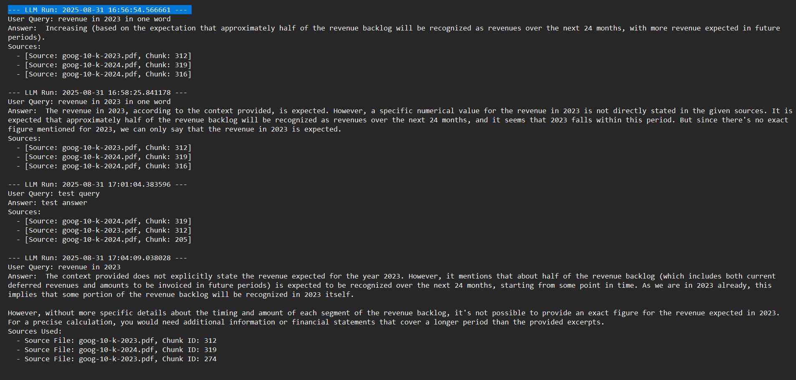
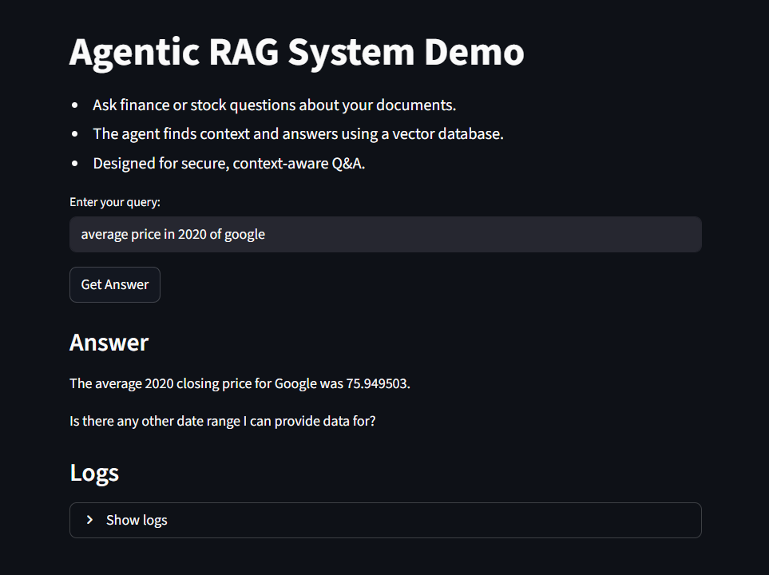

# Agentic-RAG-demo

## About
It is a demonstration project of Retrieval Augmented Generation (RAG) where I used Sentence Transformers to convert data into embeddings. Used Vector DB to store and retrieve vectors as per user query and make answers context-aware. Used LLM to synthesize answers per query.

This repository contains research Jupyter Notebooks, RAG pipeline file, and a Streamlit web application. The project is specifically customized for Google financial data (2023 and 2024) and Google stock price analysis.

---

## Project Phases

### 1. Research & Data Preparation
- **Data Collection:** Gathered Google stock price data and financial reports for 2023 and 2024.
- **Preprocessing:** Cleaned and structured the data for efficient retrieval and downstream tasks.
  
### 2. Jupyter Notebook Prototyping
- **Step-by-step RAG Implementation:** Developed and tested the RAG pipeline in Jupyter Notebooks for rapid experimentation.
- **Modular Design:** Built retriever and planner modules with clear interfaces for easy scalability.
- **Evaluation:** Assessed the quality of the retriever and planner on Google financial queries.

### 3. Streamlit Application
- **Interactive UI:** Built a user-friendly Streamlit web app for real-time querying and visualization.
- **Logs:** Displayed logs and intermediate results for transparency and debugging.

---

## Installation Guide

### Prerequisites
- Python 3.10 or higher
- Jupyter Notebook or JupyterLab environment
- Git (to clone the repository)

### Step 1: Clone the repository
```bash
git clone https://github.com/dev-nikhil02/Agentic-RAG-demo
cd Agentic-RAG-demo
```

### Step 2: Set up a virtual environment (optional but recommended)
```bash
python -m venv venv
source venv/bin/activate  # On Windows: venv\Scripts\activate
```

### Step 3: Set API Key
Set your Cohere API key in a `.env` file:
```
COHERE_API_KEY=your_api_key
```

### Step 4: Install dependencies
You can install the required Python packages by running:
```bash
pip install -r requirements.txt
```

---

## Usage

### Running the research Notebooks
1. Launch Jupyter Notebook:
   ```bash
   jupyter notebook
   ```
2. Open the main notebook file (e.g., `Agentic-RAG-demo.ipynb`).
3. Note - It is only for research purpose

### Running the Streamlit App
Use this command in your terminal after installing the dependencies. This will run the app in your browser:
```bash
streamlit run app.py
```
**Streamlit UI Features:**
- Query input for financial questions about Google
- Display of generated answers with retrieved context
- Logs and intermediate results for transparency

---

## Architecture Overview

The project architecture is designed around two main components:

1. **Retriever Module:**  
   - Searches and retrieves relevant documents or passages from the Google financial dataset based on input queries.
   - Uses vector similarity search (e.g., ChromaDB) for efficient retrieval.

2. **Generator Module:**  
   - Uses retrieved documents as context to generate informed responses or summaries.
   - Powered by generative transformer models (**Cohere**).

3. **Streamlit UI Layer:**  
   - Provides an interactive interface for users to input queries and view results.
   - No need to select data source as the planner module is implemented.

**Customized RAG Pipeline for Google Financial Data:**
- Data Source: Google financial reports (2023, 2024), stock price CSVs.
- Retrieval: Semantic search over financial documents and time-series data.
- Generation: Summarization and Q&A tailored to financial context.
- Stored Logs for all of this.


### Architectural Diagram
  

---

## Screenshots / Results

### Sample Output
>   
> *Example of generated text with retrieved context for Google financial data.*

### Notebook Interface
>   
> *Interactive Jupyter Notebook demonstrating the workflow.*

### Logs File
>   
> *Stored logs in separate file.*

### Streamlit UI
>   
> *Streamlit app interface for querying Google financial data and visualizing stock prices.*

## Contributing
Contributions, suggestions, and bug reports are welcome! Please open an issue or submit pull requests to improve the project.

---
